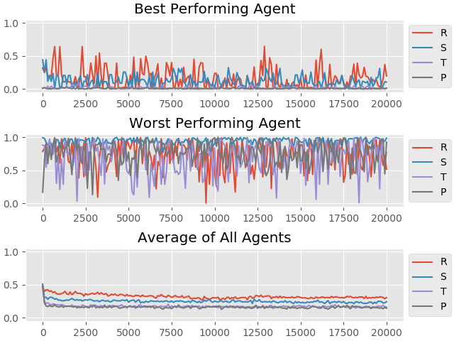
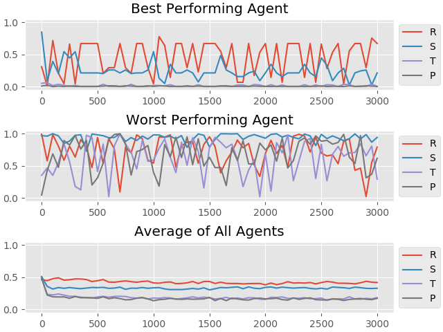
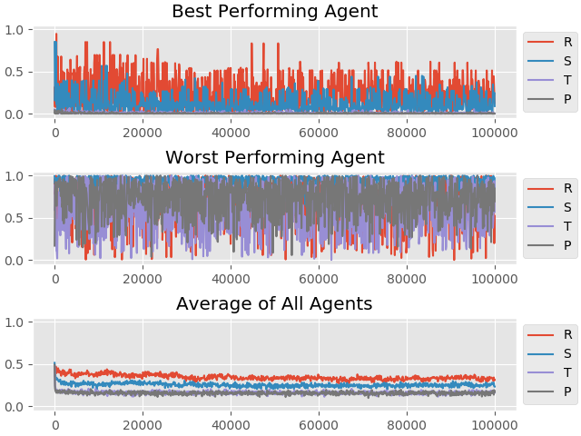

In this project I tried to recreate the results reached in an article named [A strategy of win-stay, lose-shift that outperforms tit-for-tat in the Prisoner's Dilemma game](https://www.nature.com/articles/364056a0)

In the article, simulation is explained with the followirng sentences:
> Two players are engaged in the Prisonner's Dilemma and have to choose between cooperation (C) and defection (D). According to their decisions, they are awarded with points. In any given round, the two players receive R points if both cooperate and only P points if they both defect; but a defector exploiting a cooperator gets T points, while the cooperator receives S (with T>R>P>S and 2R>T+S). Thus in a single round it is always best to defect, but cooperation may be rewarded in an iterated (or spatial) Prisoner's Dilemma.

There are two seperate folders, containing two seperate programs in this repository. One is the first implementation, written without use of multi-threading; in the second implementation, I tried to harness the power of multi-threading and somewhat succeeded.

## Results
As I developed the software, I gradually added new functionalities and tested them by generating data and observing the evolution of behavior of agents. 

I started with the most basic functionalities; creating agents with random strategies, matching them to generate scores, replacing the worst performing agents with new random agents. Results looked like this:

#### Graph 1

In the plots, horizontal axis represents the number of generation. Vertical axis represents agent's probability to cooperate in the next round given the previous result. For example, it we can see that in the first generation, the best performing agent's probability of cooperating is a number just below 0.5 if the previous result is S (blue line).

#### Graph 2

#### Graph 3

Here are my observations for these 3 initial attemps:
- Average strategies are stable in uncooperative levels, no changes occur in the overall strategy of the population.
- Strategy of the best performing agent often attempts to develop a cooperative strategy but fails everytime. 